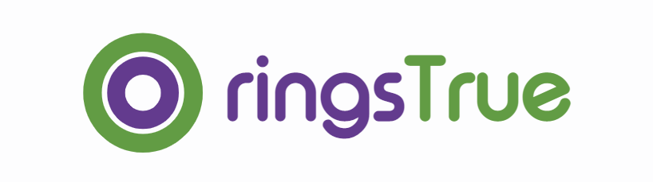
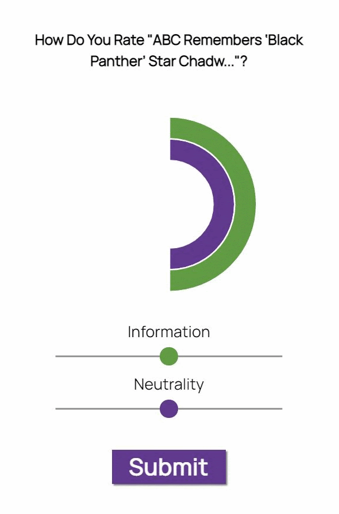

# ringsTrue

[ringsTrue](http://ringstrue.nellienelson.com/) is a news network rating app where anyone can be the judge. You will be asked to critique five anonymized articles a day. Then compare your rating to the network's overall ranking and to your preconceived notions!

## Getting Started

Go to [the hosted website](http://ringstrue.nellienelson.com/) to use the product, otherwise clone the repository if you with to edit the project. 

### Prerequisites

You will need to run 'npm install' in your cloned directory to receive all the dependencies. Then to work on the project in development mode have two terminals open. In one run 'gulp' to compile the jsx and sass files, it will watch for changes and recompile from then on. In the second terminal, run 'npm run mon' to start the server with nodemon which will restart itself after you change anything outside the public directory. 

## Built With

* [Mongoose](https://mongoosejs.com/docs/index.html)
* [React](https://reactjs.org/docs/getting-started.html)
* [Gulp](https://gulpjs.com/docs/en/getting-started/quick-start)
* [Sass](https://sass-lang.com/guide)
* [Chartjs](https://www.chartjs.org/docs/latest/)
* [Heroku and Heroku Scheduler](https://devcenter.heroku.com/articles/scheduler)

## License

Copyright 2020 Kaylee Nelson

Permission is hereby granted, free of charge, to any person obtaining a copy of this software and associated documentation files (the "Software"), to deal in the Software without restriction, including without limitation the rights to use, copy, modify, merge, publish, distribute, sublicense, and/or sell copies of the Software, and to permit persons to whom the Software is furnished to do so, subject to the following conditions:

The above copyright notice and this permission notice shall be included in all copies or substantial portions of the Software.

THE SOFTWARE IS PROVIDED "AS IS", WITHOUT WARRANTY OF ANY KIND, EXPRESS OR IMPLIED, INCLUDING BUT NOT LIMITED TO THE WARRANTIES OF MERCHANTABILITY, FITNESS FOR A PARTICULAR PURPOSE AND NONINFRINGEMENT. IN NO EVENT SHALL THE AUTHORS OR COPYRIGHT HOLDERS BE LIABLE FOR ANY CLAIM, DAMAGES OR OTHER LIABILITY, WHETHER IN AN ACTION OF CONTRACT, TORT OR OTHERWISE, ARISING FROM, OUT OF OR IN CONNECTION WITH THE SOFTWARE OR THE USE OR OTHER DEALINGS IN THE SOFTWARE.

## Acknowledgments

* Thank you to Eric, Colin, and Andy for being the best instructional team I could have asked for.
